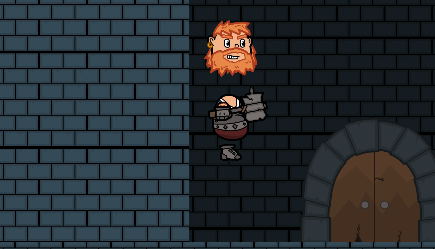
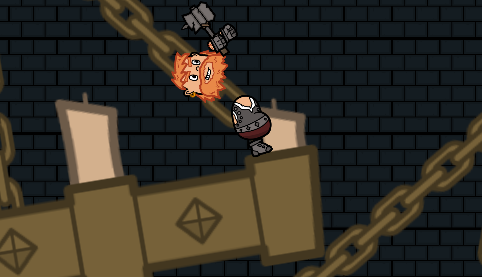
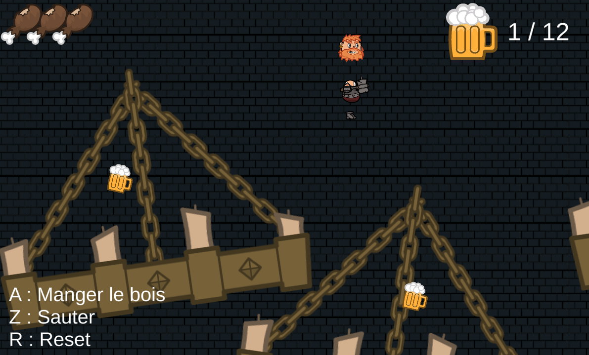
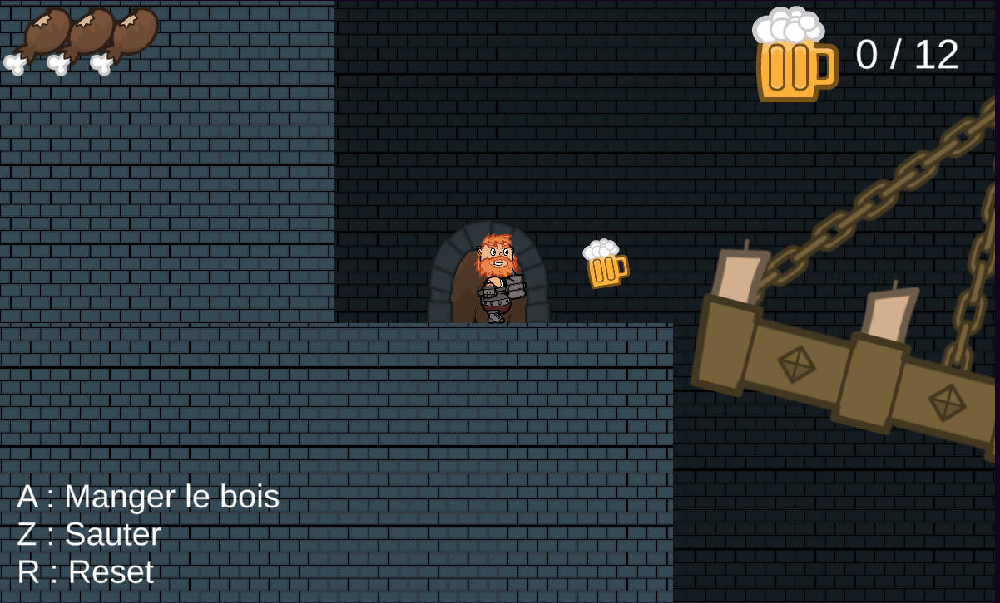
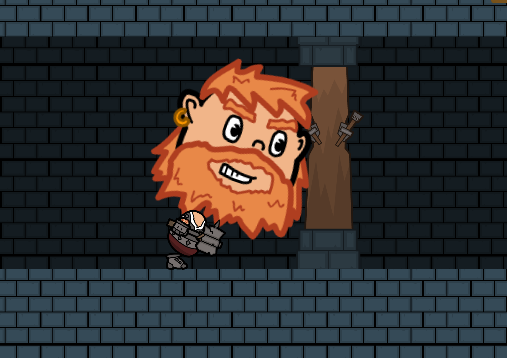

# 2D Dwarf Platform <a href="https://archer01.itch.io/dwarf-platformer-2d">(Play game)</a>&nbsp;

 
  &nbsp
  &nbsp
  &nbsp
  &nbsp
  

---

## Résumé
Exercice simulant un jeu de plateforme en 2D avec un nain et quelques animations

---

## Features
  * Chandeliers mouvant (avec un Hinge Joint 2D)
  * Déplacement, Jump, Manger le bois
  * Plateformes mouvantes avec le personnage
  * Collectible de bières

---

## Liens
  * <a href="https://www.youtube.com/channel/UCwxuydeEi6WyM-X6nsPs-8A">Youtube</a>
  * <a href="https://archer01.itch.io/">Itch.io</a>
  * <a href="https://hashnode.com/@Archer01">Hashnode (Dev Blog)</a>
  * <a href="https://www.linkedin.com/in/julienguenard/">Linkedin</a>
  * <a href="https://twitter.com/julien_guenard">Twitter</a>
